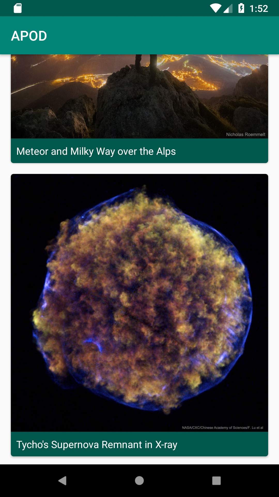

# Astronomy Photo of the Day

A Kotlin Android app demonstrating a modern architecture consisting of Kotlin, MVVM, RxJava, Koin, LiveData and lifecycle aware ViewModels.

View state is represented by an immutable data class emitted as a LiveData subscription from the ViewModels. 

### Architecture

[MVVM](https://en.wikipedia.org/wiki/Model%E2%80%93view%E2%80%93viewmodel)

[Android Arch ViewModel](https://developer.android.com/topic/libraries/architecture/viewmodel)

[RxJava](https://github.com/ReactiveX/RxJava)

[RxAndroid](https://github.com/ReactiveX/RxAndroid)

[LiveData](https://developer.android.com/topic/libraries/architecture/livedata)

[Koin](https://insert-koin.io/)
 
### Testing
[Junit](https://junit.org/junit4/)

[Mockito](http://site.mockito.org/)

[Espresso](https://developer.android.com/training/testing/espresso/)

### Building the project

To build the project, you will need your own auth token for the NASA APOD API ([sign up here](https://api.nasa.gov/index.html#apply-for-an-api-key)). If you don't follow the steps below, the project will not compile.

Once you have a key, you will need to make it available as a gradle.properties file. Navigate to '$HOME/.gradle/' and if a gradle.properties file does not exist, create it.

Add the following to the gradle.properties file, replacing XYZ for your NASA API key.
```
nasaApiKey=XYZ
```

After a project refresh, you should see the gradle.properties file in the Android Studio project browser view under 'Gradle Scripts'. Switch to the Android view if you don't see 'Gradle Scripts'

### Screenshots

